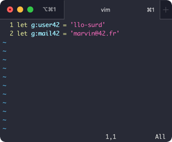
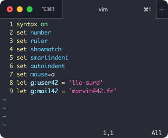

# 42 Off Campus Student Set Up (MacOS)

With this guide, you can install the Norminette, 42 Header, and access your 42 repositories on your Mac. 

Remote study shouldn't replace going onto campus. Use this to get some extra study in or when coming into 42 isn't an option. ☺︎

## Contents

[Terminal](#terminal)  
[SSH key](#generating-an-ssh-key)  
[Norminette](#norminette)  
[42 Header](#42-header)  
[Vimrc Configurations (Optional)](#vimrc-configurations-optional)  

## Terminal

For this step, you can use your preferred Terminal emulator. Your Mac will have the Terminal app installed, however at 42 iTerm is used. [iTerm Download](https://iterm2.com/downloads.html)

## Generating an SSH key

You will need to generate an SSH key to access Vogsphere for your Git repositories.

To generate a public and private key use `ssh-keygen` in your chosen terminal.

Press enter when asked to enter a file to save the key in, and follow the password prompts.  
Use `cat ~/.ssh/id_rsa.pub` to view your generated key.

Copy the key as you’ll need it for the next steps.

In your [intra](https://intra.42.fr) settings go to **SSH key** and select **New SSH key**, paste in your key and give it a name. After saving, you can access your 42 Vogsphere repositories.

You can use this same key later on in the guide if you would prefer to use SSH on Github.

## Norminette

To install the Norminette visit the link and follow the installation instructions. You'll need Python for this but your Mac should have it installed. To check you have the correct version of Python use `Python --version.`
[Norminette on Github](https://github.com/42School/norminette) 

## 42 Header

You can install the 42 header for both VIM and Visual Studio code, if you are in the Piscine it’s recommended to keep using Vim.

### 42 Header (Vim)

For the 42 header files visit the link.  [42 Header on Github](https://github.com/42Paris/42header)

Click the  button to clone the repository or to download the ZIP.

Once the files are on your Mac you can use your terminal or Mac graphical interface to navigate them.

##### Terminal method
Inside the 42 header folder go into the plugin directory, it will have the **stdheader.vim** file inside. If you're not using your own plugin manager use `cp stdheader.vim ~/.vim/plugin`. This will copy the file into the */.vim/plugin* directory.

##### Graphical interface method
Inside the 42 header folder go into the plugin directory, it will have the **stdheader.vim** file inside. If you're not using your own plugin manager you can copy this file into the */.vim/plugin* path by going to the menu bar and clicking *Finder > Go > Go to Folder…* type in *“~/.vim/plugin”* when prompted and paste a copy of **stdheader.vim** inside.

#### Configuring your header

Use `cd ~` to get back to your home directory then type `vim .vimrc`. This file may already exist and have text inside. If it does add these configurations at the top or bottom of the file. Change intraname to your intra login name, and leave the email as it is.   
`let g:user42 = 'intraname'`  
`let g:mail42 = 'marvin@42.fr'`

Save and quit Vim.

### 42 Header (Visual Studio Code)

Use the link to install the 42 header extension in Visual Studio Code, in the extension settings change the username to your intra login name and use marvin@42.fr as the email. 
[42 Header Extension](https://marketplace.visualstudio.com/items?itemName=kube.42header)

## Vimrc Configurations (Optional)

You can edit the .vimrc file from earlier to add Vim configurations, these configurations will give Vim similar settings to the 42 computers without having to apply them each time.

`syntax on`  
`set number`  
`set ruler`  
`set showmatch`  
`set smartindent`  
`set autoindent`  
`set mouse=a`  

Your .vimrc file might look a bit like this:

Your Mac is now ready for remote study!
